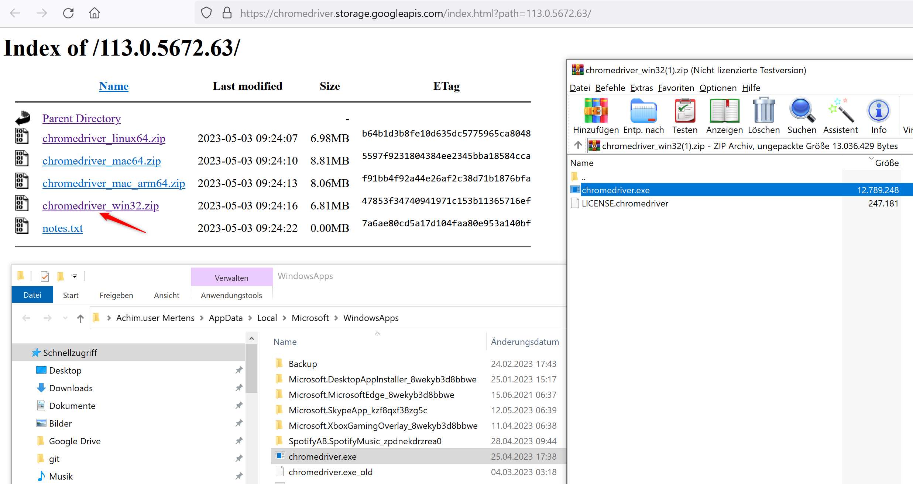

# Tokenstats

This Tool creates statistics for HIVE tokens.

## Install
### Chrome Driver
You need to download and set set a path to the chromedriver:
https://sites.google.com/chromium.org/driver/downloads?authuser=0

### Node
You need to have installed node

# Execute

01. ggf. Datum in "surfkibana.js" (now-7d austauschen gegen z.B. now-14d) und "createText.js" (z.B. timeframe=14) anpassen.
02. "node surfKibana.js" ausführen.
03. Ein Screenshot von [Hive in CoinMarketCap](https://coinmarketcap.com/currencies/hive-blockchain/) nehmen, in peakd.com hochladen und Bild-Text in otherTokensTemplate.txt einfügen
04. manuell ${TOKEN}images.txt befüllen
05. "node createText.js" hier ausführen (Achtung: Datum evtl. anpassen), um die Textbausteine für die jeweiligen Token zu erstellen
06. Die TokenTextbausteine in Peakd.com einfügen und Tabellen und Tokenprice ändern.

Written by Achim Mertens
