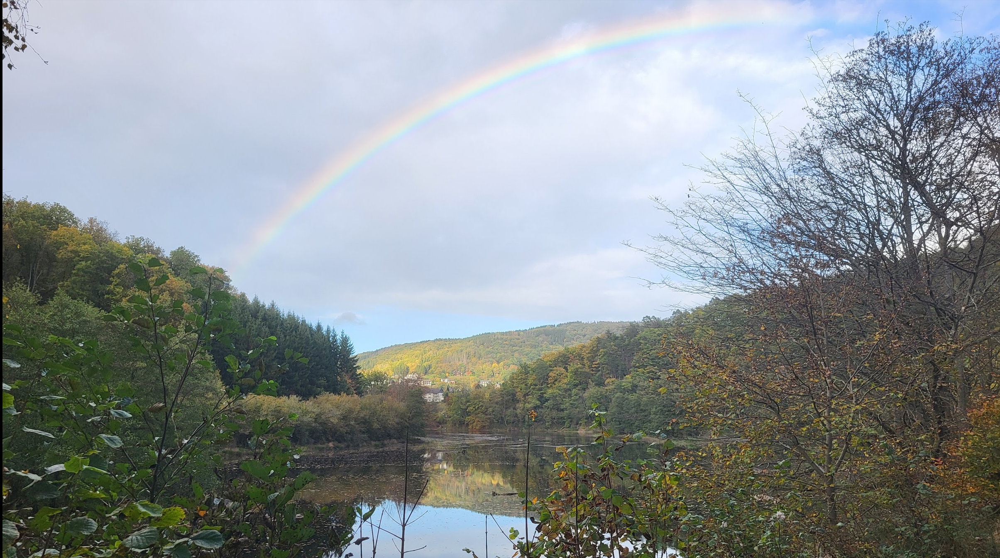
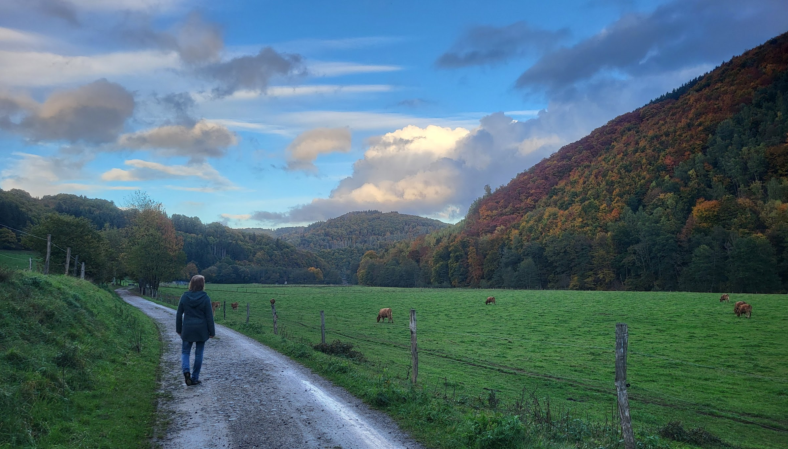

Hello dear Hivers,

here are the:

# [TOKEN] Statistics For The Last [DAYS] Days, [DATE_FRAME]:

## Who has bought how many [TOKEN] at which time:

BILD_01

## Top [TOKEN] Buyers And $HIVE Sellers
The inside of the circle shows the buyers of [TOKEN], ordered by $HIVE they have spent. The outside shows the recipients of that $HIVE (sellers of [TOKEN]):
BILD_02

## Comulated Amount Of Bought [TOKEN] Per Person
Top 10 [TOKEN] buyers, how much they got and how much $HIVE they spend for this. Sorted by $HIVE, that was spent:
BILD_03

## Top 20 [TOKEN] Buyers
Sorted by the $HIVE, they have spent:
Buyer(Descending)|Sold $HIVE|% Sold $HIVE|Bought [TOKEN]|Avg. Price|Number of Trades
|-|-|-|-|-|-|
TABLE01

## Comulated Amount Of Sold [TOKEN] Per Person
Top 10 [TOKEN] Sellers, how much they sold and how much $HIVE they got for this, sorted by $HIVE:
BILD_04

## Top 20 [TOKEN] Sellers
Sorted by the $HIVE, they have got:
Seller(Descending)|Earned $HIVE|% Earned $HIVE|Sold [TOKEN]|Avg. Price|Number of Trades
|-|-|-|-|-|-|
TABLE02

## Price Of The [TOKEN]
BILD_05

## [TOKEN] Summarize Metrics

Request|Received Hive|Received HIVE %|Sold [TOKEN]|Avg. Price
|-|-|-|-|-|
[BUYVSSELLERTABLE]

---

[OTHERTOKENS]

---

Links:

[How I Have Set Up Elasticsearch And Kibana On My Raspberry Pi To Monitor Token Activities](https://peakd.com/hive-122315/@achimmertens/how-i-have-set-up-elasticsearch-and-kibana-on-my-raspberry-pi-to-monitor-token-activities) and here: [Do You Want To See Statistics Of Your Favorite HIVE Token?](https://peakd.com/hive-167922/@achimmertens/do-you-want-to-see-statistics-of-your-favorite-hive-token) or on [github](https://github.com/achimmertens/HiveTokenELK/tree/master).

https://peakd.com/@advertisingbot2/posts?filter=stats
https://peakd.com/@achimmertens

https://github.com/achimmertens

---

# My last two weeks
Yes, last week there were no stats, because I was off. My wife and me enjoyed the great nature environment in the "Eifel" in our [flat](https://fewo.amertens.me/).

This week I was on a Keycloak training. Here are my notes, that I made: [Part 1](https://peakd.com/hive-121566/@achimmertens/keycloakschulung-mitschrift),[Part 2](https://peakd.com/hive-121566/@achimmertens/keycloakschulung-mitschrift-teil-23), and [Part 3](https://peakd.com/hive-121566/@achimmertens/keycloakschulung-mitschrift-teil-33).

And, the most important and greatest news: My oldest daughter is going to marry, she got engaged last week.

:-D

Achim Mertens